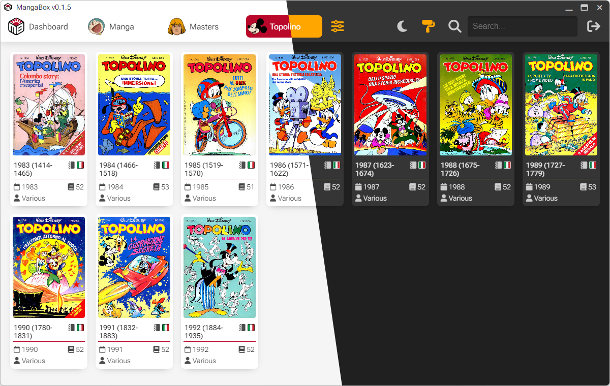

<picture></picture>

MangaBox is a simple Electron client for Komga.
It is available for Windows (x86 and ARM), macOS (Intel and Apple Silicon) and Linux (as an AppImage).

 Clean design, tailored for few libraries. MangaBox is a reader first, and doesn't feature library management.

 Rich library view with metadata taken from "alternate title" fields like "Story", "Art," and "Time".

 Series view with all the volumes and series metadata. There's no book view (yet).

 Reading mode supports two pages spreads, with "paper-like" effects and page animations.
 

 Thumbnail view in reading mode for page preview.

 Light and dark theme are supported, and different color highlights.

 Sorting and filtering of libraries.

 Global search for series and books looks into metadata, summary etc.
	