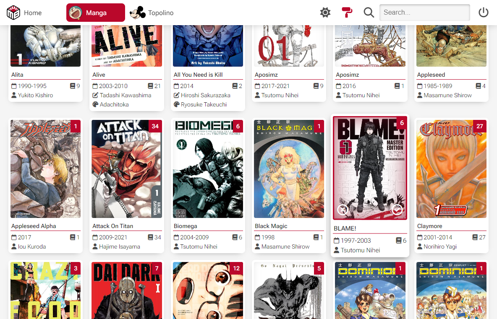
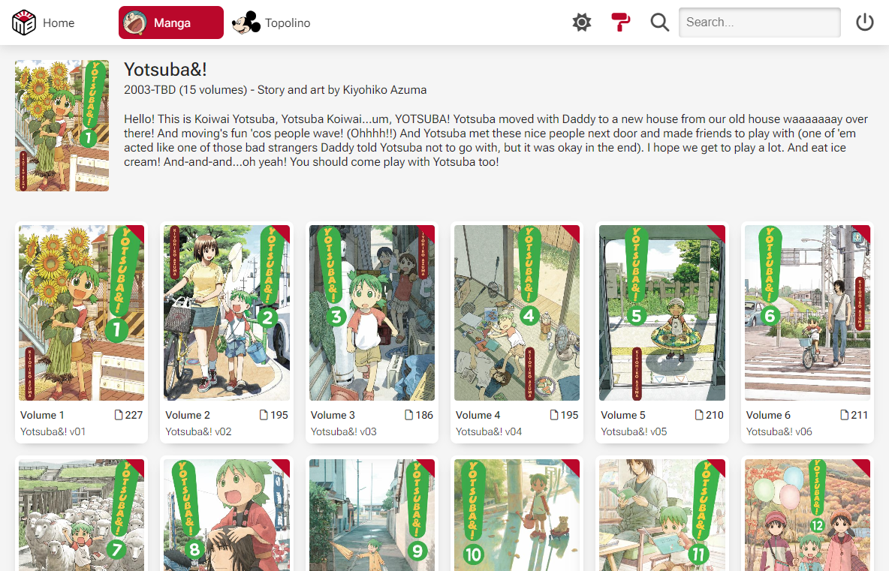
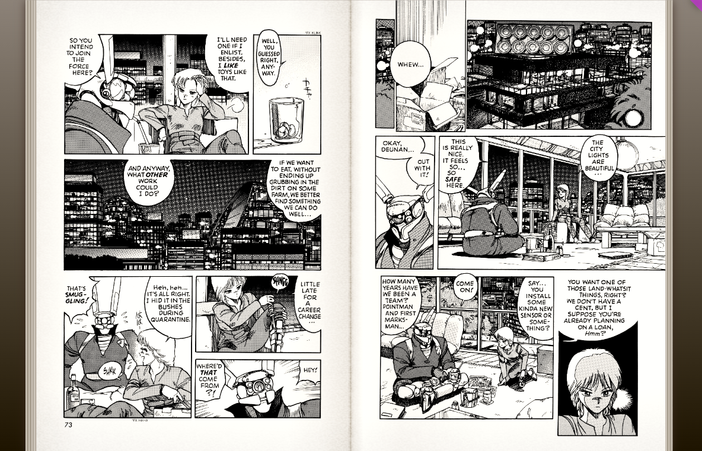

<picture></picture>

MangaBox is a simple Electron client for Komga.

Clean design tailored for few libraries, it doesn't feature library management but only reading.

It has a rich library view with metadata taken from "alternate title" fields like "Story", "Art" and "Time". 

There's no book view (yet) but a series view with all volumes.

Reading mode supports two pages and single page, with "paper like" effects

