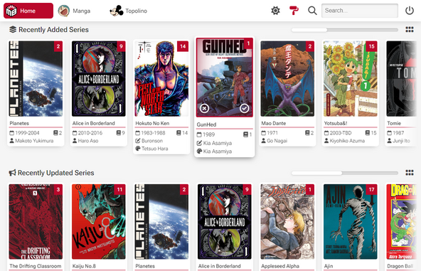
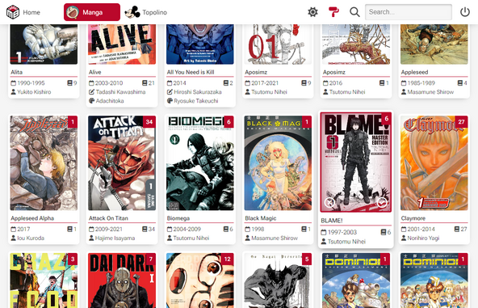
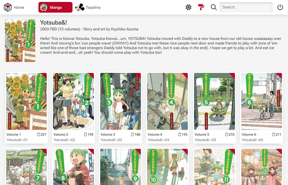
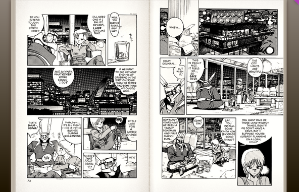

MangaBox is a simple Electron client for Komga.

<picture></picture>

It is very simple and tailored for few libraries, it doesn't feature library management but only reading.

It has a rich library view with metadata taken from "alternate title" fields like "Story", "Art" and "Time". There's no book view (yet) but a series view with all volumes.

<picture></picture>

<picture></picture>

There's a reading mode with two pages or one page, and "book like" effects

<picture></picture>
