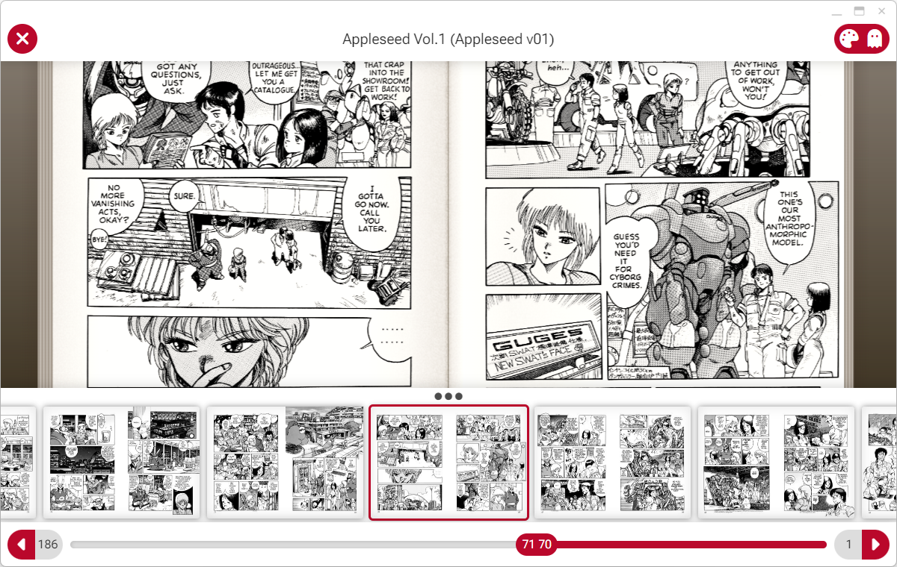

<picture></picture>

MangaBox is a multiplatform, web based client for <a href="https://komga.org">Komga</a>, the manga and comics media server.
		

		
MangaBox is available in different formats:
- Web/PWA - Deploy MangaBox on a personal web server, use it in the browser or as a PWA on your device.

- Electron desktop application
	- Windows (x86 and ARM)
	- macOS (Intel and Apple Silicon)
	- Linux (AppImage)

- Capacitor mobile application
	- Android APK - Debug APK, you can manually install on Android devices
	- iOS/ipadOS .ipa - Unsigned app for Apple devices, you can sideload it with AltStore or similar
	- iOS/ipadOS .app - App bundle for testing on XCode simulator (universal binary)

 

Clean design, tailored for few libraries. MangaBox is a reader first, and doesn't feature library management.
 
 
 Rich library view with metadata taken from "alternate title" fields like "Story", "Art," and "Time".
 
 
 Series view with all the volumes and series metadata. There's no book view (yet).
 
 
 Reading mode supports two pages spreads, with "paper-like" effects and page animations.
 
 
 Thumbnail view in reading mode for page preview.
 
 
 Light and dark theme are supported, and different color highlights.
 
 
 Sorting and filtering of libraries.
 
 
 Global search for series and books looks into metadata, summary etc.
 
 
 Search prefix "y:" allows to filter all the series that have volumes in that date range.
 
 
 Set book tag "no-cover" to start the book with a page spread, or "no-blank-page" to add a fake back of the cover image.
 
 