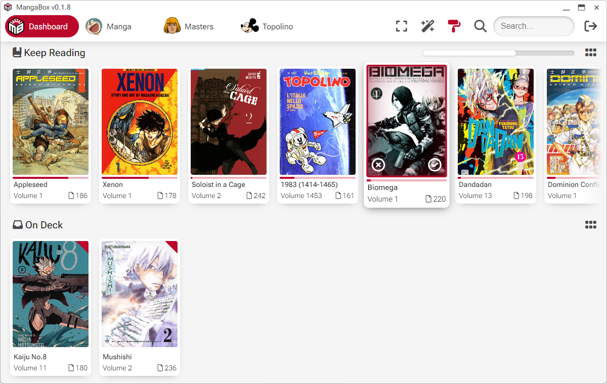

<picture></picture>

MangaBox is a multiplatform, web technology based client for <a href="https://komga.org">Komga</a>, the manga and comics media server.		

## Supported platforms

- Web/PWA - Deploy MangaBox on a personal web server, use it in the browser or as a PWA on your device.

- Electron desktop application
	- Windows (x86 and ARM)
	- macOS (Intel and Apple Silicon)
	- Linux (AppImage)

- Capacitor mobile application
	- Android APK - Debug APK, you can manually install on Android devices
	- iOS/ipadOS .ipa - Unsigned app for Apple devices, you can sideload it with AltStore or similar
	- iOS/ipadOS .app - App bundle for testing on XCode simulator (universal binary)

## Installation notes

- To deploy the web verions just download the "web" release artifact and unpack it in a "mangabox" folder on your web server. Because of CORS limitation by default MangaBox will work only if it's on the same location as your komga server.

- Electron version is not limited by CORS and it will work with any Komga server.

- The macOS binaries are not signed, so they won't run by default. You can allow them to run on Intel macs by right-click/open but on Apple Silicon you'll need to ad-hoc sign the binary. This is a simple bash script that will do the hard work for you:

  ```
  #!/bin/bash
  app="$1"
  xattr -d com.apple.quarantine "${app}"
  find "${app}/Contents" -type f -exec codesign --force --timestamp --verify --verbose --sign - "{}" \;
  codesign --force --timestamp --verify --verbose --sign - "${app}"
  ```

	Just chmod +x the script and run it with the .app file path as argument.

- Mobile versions are not signed, you can sideload the Android apk on your device, and you can sideload the iOS/ipadOS version using a developer tool like AltStore which will self sign and renew the signature every 7 days.

## Features gallery
<table>
<tr>
	<td valign=top width=50%>
		<br>
		MangaBox is a reader first, and doesn't feature library management. It features clean design, touch and mouse driven interface. You can drag and drop an image to change the library icons.
	</td>
	<td valign=top width=50%>
		<br>
		Library view features series metadata. You can add alternate titles in Komga: "Story" and "Art" to set a series authors, "Time" for series dates.
	</td>
</tr>
</table>
<table>
<tr>
	<td valign=top width=50%>
		<br>
		Series view with all the volumes and series metadata. Each book has read/unread controls and a summary view button.
	</td>
	<td valign=top width=50%>
		<br>
		Reading mode replicates the look of a real manga or comic book. It is based on two pages spreads, with paper-like effects and page animations.
	</td>
</tr>
</table>
<table>
<tr>
	<td valign=top width=50%>
		<br>
		Reading mode features thumbnails for page preview. Thumbnails can be enlarged using a gesture or a button.
	</td>
	<td valign=top width=50%>
		<br>
		Light and dark theme are supported, and different color highlights.
	</td>
</tr>
</table>
<table>
<tr>
	<td valign=top width=50%>
		<br>
		Libraries can be sorted on the fly or filtered by read/unread, reading direction, language.
	</td>
	<td>
		<br>
		Search is global for both series and books, and looks into metadata, summary etc.
	</td>
</tr>
</table>
<table>
<tr>
	<td valign=top width=50%>
		<br>
		A special search prefix "y:" will show all the series that have volumes in that date range.
	</td>
	<td valign=top>
		<br>
		You can set special book tags in Komga: "no-cover" starts the book with a page spread, "no-blank-page" adds a fake back of the cover image.
	</td>
</tr>
</table>
